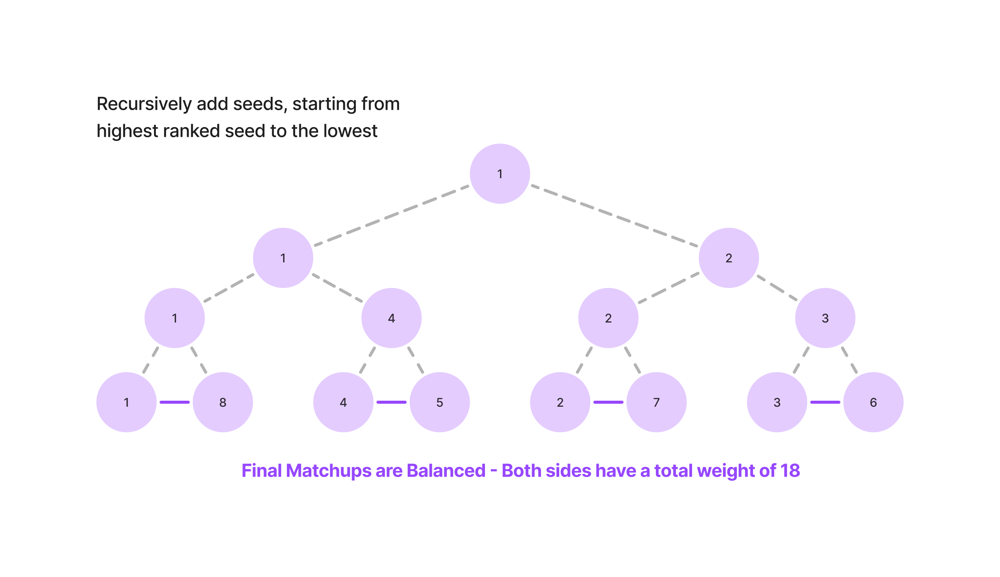

# CS203-Kickoff

## Project Overview
Kickoff is a community-led tournament management system for football in Singapore, connecting clubs and players through various features including tournament hosting, player recruitment, and club management. Additional features such as tournament bracket auto-creation, club seeding and administrator venue verification help improve the user experience.

## Application Features


## Seeding
To ensure a balanced bracket that favours higher seeds by matching against lower seeds, we used a recursive seeding algorithm with mirroring (matching the higher seeds of previous rounds against lower seeds).



## Tech Stack

### Backend
1. Spring Boot (Java 21)
2. Mockito

### Frontend
1. React
2. TypeScript
3. Tailwind CSS

### DevOps
1. Docker
2. Github Actions
3. SonarCloud
4. AWS (S3, ECS, RDS, Cloudfront, Route 53)
5. Terraform

## Directory Structure
```plaintext
.
├── backend
│   ├── chatbot
│   ├── clubs
│   ├── tournaments
│   └── users
├── frontend
└── terraform
    └── modules
        ├── ecs
        ├── network
        └── rds
```

## Microservices Overview
We have 4 backend microservices designed to handle specific functions within the application independently, enabling modular development, scalability, and fault isolation.
- **Chatbot**: Python-based microservice for AI-powered user interactions and automated responses.
- **Clubs**: Java Spring Boot service managing club creation, membership, and details.
- **Tournaments**: Java Spring Boot service handling tournament management, scheduling, and participant tracking, with Stripe API integration for payments.
- **Users**: Java Spring Boot service focused on user account management and authentication.

## Deployment Architecture Overview


### Architecture Components

This deployment architecture is designed for high availability, scalability, and security, managed through Terraform for infrastructure as code (IaC). Below is a breakdown of the main components and their interactions:

- **User Access**:
  - Users access the application through **Route 53**, which routes traffic to **CloudFront** for content delivery.
  - The frontend is hosted on an **S3 bucket**, which is integrated with **CloudFront** for improved distribution and caching.

- **Load Balancing and Networking**:
  - Traffic is managed by an **Application Load Balancer (ALB)**, which forwards requests to various **ECS clusters**.
  - An **Internet Gateway (IGW)** is used to allow resources within the public subnet to connect to the internet.

- **ECS Clusters**:
  - **Users ECS**: Handles user-related services
  - **Clubs ECS**: Manages club-related services
  - **Tournaments ECS**: Hosts tournament services, including integration with **Stripe API** for verification payment
  - **Chatbot ECS**: Supports chatbot functionalities
  - All of our ECS Clusters are desgined to scale based on load.

- **Database Layer**:
  - Each ECS service has a dedicated **MySQL RDS** instance in the private subnet:
    - **Users RDS**
    - **Clubs RDS**
    - **Tournaments RDS**
  - This configuration ensures data security by isolating databases from public access.

- **Storage Services**:
  - **Profile Pictures S3**: Stores user profile pictures.
  - **Verification Pictures S3**: Holds tourament verification images for hosts.

### Security and Compliance

- **Security Services**:
  - **Certificate Manager**: Manages SSL/TLS certificates for secure connections.
  - **WAF (Web Application Firewall)**: Protects against common web exploits.
  - **IAM (Identity and Access Management)**: Controls access to AWS services and resources.

- **Monitoring and Management**:
  - **CloudWatch**: Monitors performance and logs, especially for auto-scaling of the ECS.
  - **Cloud Map**: Provides service discovery for the microservices, allowing for microservice-to-microservice communication to ensure data consistency.

### Infrastructure Management

- **Terraform**: The entire architecture is provisioned and managed using Terraform, ensuring consistency and ease of deployment.

## CI/CD Pipeline Overview

Our CI/CD pipeline automates the complete process of building, analyzing, deploying, and managing the infrastructure of the entire application. It ensures that each part of the app (backend, frontend, and infrastructure) is managed through dedicated workflows triggered by specific events such as merges, pull requests, or manual triggers.

### Key Workflows

- **Merge to Main:**

  

  - **Backend Changes**:
    - Runs jobs for each microservice to build and push Docker images to Docker Hub.
    - If applicable, downloads data from S3 and deploys to ECS with a forced new deployment if the service is already running.
    - Runs analysis jobs for microservices using `SonarQube` to ensure code quality and security.
  - **Frontend Changes**:
    - Builds the frontend, syncs built files to an S3 bucket, and invalidates the CloudFront cache for updated content delivery.
  - **Infrastructure (Terraform) Changes**:
    - Runs `terraform plan`, and if successful, applies the changes using `terraform apply`.

- **Pull Requests:**

  

  - **Backend Changes**:
    - Builds and analyzes microservices and posts code quality feedback on the PR.
  - **Frontend Changes**:
    - Builds the frontend, and comments the build results on the PR for reference.
  - **Terraform Changes**:
    - Runs `terraform plan` and comments the plan results on the PR for review before merging.
- **Manual Trigger:**

  

  - **Infrastructure Cleanup**:
    - Runs `terraform destroy` to decommission and clean up infrastructure resources when needed.

## Backend Setup

### Java-based Microservices (Clubs, Tournaments, Users)

1. **Navigate to the microservice directory** (choose `clubs`, `tournaments`, or `users`):
   ```bash
   cd backend/<microservice-name>  # Replace <microservice-name> with clubs, tournaments, or users
   ```
2. Make the Maven wrapper executable:
   ```bash
   chmod +x mvnw
   ```
3. Run the Spring Boot application:
   ```bash
   ./mvnw spring-boot:run
   ```

### Python-based Microservice (Chatbot)

1. **Navigate to the chatbot directory** 
   ```bash
   cd backend/chatbot
   ```
2. Set up a Python virtual environment:
   ```bash
   python3 -m venv venv
   ```
3. Activate the virtual environment:
   - Linux/macOS
      ```bash
      source venv/bin/activate
      ```
   - Windows
      ```bash
      source venv/bin/activate
      ```
4. Install the dependencies:
   ```bash
   pip install -r requirements.txt
   ```
5. Run the chatbot application:
   ```bash
   uvicorn kickoff_chatbot_api:app --host 127.0.0.1 --port 8083
   ```

## Frontend Setup
1. Navigate to the frontend directory:
   ```bash
   cd frontend
   ```
2. Create a .env file in the `frontend` directory and add the following default environment variable values:
   ```bash
   VITE_USER_SERVICE_BASE_URL=http://localhost:8081/api/v1
   VITE_TOURNAMENT_SERVICE_BASE_URL=http://localhost:8080/api/v1
   VITE_CLUB_SERVICE_BASE_URL=http://localhost:8082/api/v1
   VITE_CHATBOT_API_URL=http://localhost:8083/api/v1/chatbot
   ```
2. Install dependencies:
   ```bash
   npm install
   ```
3. Start the development server:
   ```bash
   npm run dev
   ```
4. Open your browser and visit `http://localhost:5173` (or the port Vite specifies)


## Contributors
Built by: 

[Joel Lim](https://github.com/LimJingKaiJoel) 

[Kaung Set Lin](https://github.com/setl1n)

[Vince Tan](https://github.com/vincetyy)

[Wu Yekai](https://github.com/yekaiwu)

[Yeo Sheen Hern](https://github.com/SheeNigami)

[Zane Chee](https://github.com/injaneity)

## License
Distributed under the MIT License. See LICENSE for more information.